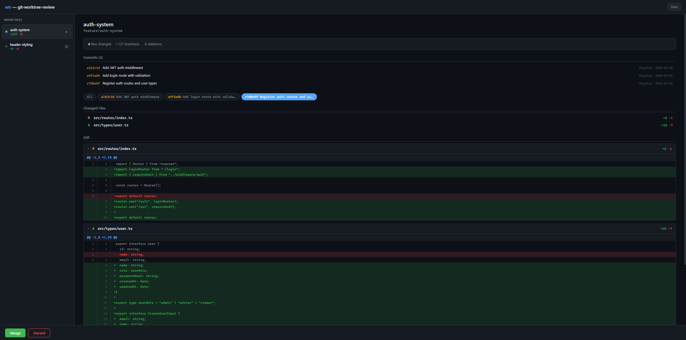

# wtr

CLI + web tool for reviewing code changes made by LLMs (or humans) in git worktrees. See diffs, browse commits, and merge or discard — all from one command.

## Why

When LLMs work in git worktrees, you need a fast way to review what they changed before merging. `wtr` gives you a summary-first workflow: see the commits, browse the diff, then merge or discard.

## Install

Requires [Bun](https://bun.sh).


Bun on WSL/Linux:
```bash
sudo apt install unzip
curl https://bun.sh/install | bash
```

Add `~/.bun/bin` to your PATH if it isn't already:
```bash
export PATH="$HOME/.bun/bin:$PATH"
```
Add `export PATH="$BUN_INSTALL/bin:$PATH"` to your "~/.bashrc" file to make it persistent.
`source ~/.bashrc` to reload bash or restart your terminal.

Install wtr:
```bash
git clone https://github.com/MayoLars/git-worktree-review
cd git-worktree-review
bun install
bun link
```

## Uninstall

```bash
cd git-worktree-review
bun unlink
```

*optional*  Remove Bun itself:
```bash
rm -rf ~/.bun
```

## Usage

Run from any git repo that has worktrees:

```bash
# List all worktrees with commits, diff stats
wtr status

# View colorized diff for a worktree
wtr diff <name>

# AI-powered summary (requires gh copilot)
wtr summary <name>

# Open the web UI at http://localhost:3000
wtr web

# Merge a worktree branch into current branch, clean up
wtr merge <name>

# Remove a worktree and delete its branch
wtr discard <name>

# Override the base branch (default: main, fallback: master)
wtr diff <name> --base develop
```

`<name>` is the worktree directory name. Run `wtr status` to see available names.

## Web UI



`wtr web` starts a local server on port 3000 (configurable via `PORT` env var or `wtr config`).

### Configure port

```bash
wtr config --port 3333
```

This saves the port to `.wtr.json` in your repo root. Run `wtr config` with no flags to view current settings.

Features:
- Dark/light theme (respects system preference)
- Sidebar with all worktrees and diff stats
- Commit history per worktree
- Unified diff view with line numbers and color-coded additions/deletions
- Collapsible file sections
- Merge and discard with confirmation dialogs
- Auto-refreshes every 30 seconds

## How It Works

```
src/
├── cli/           Command router + CLI commands
│   ├── index.ts   Entry point, argument parsing
│   ├── status.ts  Worktree list with commits and stats
│   ├── diff.ts    Colorized terminal diff
│   ├── summary.ts AI summary via gh copilot (falls back to git stats)
│   ├── merge.ts   Merge with confirmation prompt
│   └── discard.ts Discard with confirmation prompt
├── core/          Shared git operations
│   ├── git.ts     All git commands (worktree list, diff, merge, etc.)
│   └── types.ts   TypeScript interfaces
└── web/           Web UI
    ├── server.ts  Bun HTTP server with REST API
    └── public/
        └── index.html  Self-contained HTML/CSS/JS (no build step)
```

The core module (`core/git.ts`) wraps git commands and is shared between CLI and web. The web server exposes the same operations as REST endpoints:

| Endpoint | Method | Description |
|----------|--------|-------------|
| `/api/worktrees` | GET | List worktrees with stats, files, commits |
| `/api/worktree/:name/diff` | GET | Full unified diff |
| `/api/worktree/:name/summary` | GET | Diff stats and file list |
| `/api/worktree/:name/merge` | POST | Merge and clean up |
| `/api/worktree/:name/discard` | POST | Remove worktree and branch |

## What Remains

- **AI summary integration** — Currently falls back to git stats. The `gh copilot explain` path exists but needs a working GitHub Copilot setup. Could be replaced with a pluggable provider (Claude API, local LLM, etc.)
- **Syntax highlighting** — Diffs use color-coded lines but no language-aware highlighting. Could add highlight.js for richer display.
- **Per-commit diff view** — Status shows commits, but you can't yet view the diff for a single commit (only the full branch diff). A `wtr show <name> <hash>` command would help.
- **Multiple repo support** — Tool must be run from inside the target repo. A config file or `--repo` flag could allow reviewing worktrees across repos.
- **Web UI: inline comments** — Currently read-only. Adding the ability to leave notes on specific lines would make it a more complete review tool.
- **Test coverage** — Core git functions have unit tests. CLI commands and web server lack automated tests.
- **CI/CD** — No pipeline yet. Could add linting, type-checking, and test runs.
